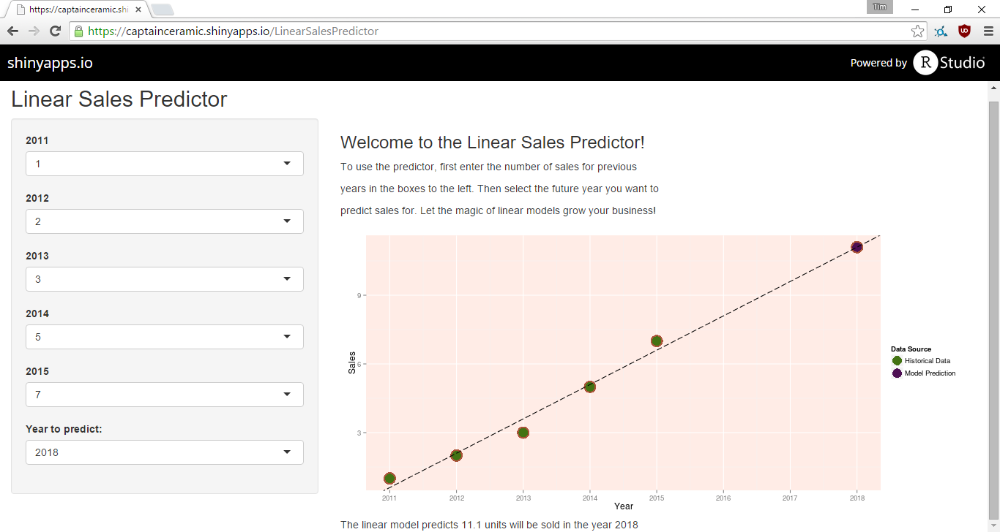

Linear Sales Predictor
========================================================
author: Tim Bedin (captainceramic on github)
date: 27/09/2015
font-family: 'Garamond'

...why the LSP?
========================================================

Does your business:
 - struggle to make simple predictions about future events by extrapolating from historical data?
 - need to leverage the power of 'Big Data' and advanced 'Data Science' to impress upper management?
 - spend all of its budget on useless consultants instead of fixing the office coffee machine?

You need the Linear Sales Predictor!

Simple web interface!
========================================================

It is very easy to use the application - all you need is your browser. Even your dullest staff member can be up and running with it in days, not months.



What dark magic runs this app?
========================================================
<small>
Why, its is a simple linear model! Check this out. Using linear regression we can predict the future.


```r
# Simply enter the known data.
sales.data <- data.frame(years = c(2014, 2015), sales = c(1, 2))
# Build a linear model using this simple syntax.
lin.model <- lm(sales ~ years, data = sales.data)

# Now predict the future!
future.val <- predict(lin.model, data.frame(years = 2016))
```

This simple trick predicts a future sales value of ``3``: that's a year-on-year increase of ``50``%!
</small>

Where can I get this?
=======================================================

Simply point your browser at:

[https://captainceramic.shinyapps.io/LinearSalesPredictor](https://captainceramic.shinyapps.io/LinearSalesPredictor)

to begin reaping the rewards of predictive sales modelling using the LINEAR SALES PREDICTOR!
